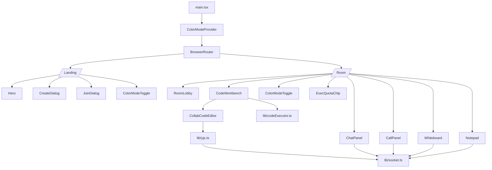
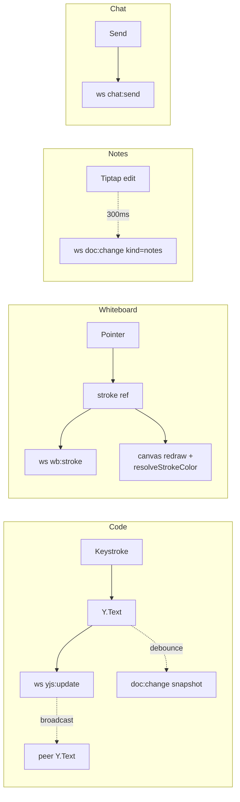
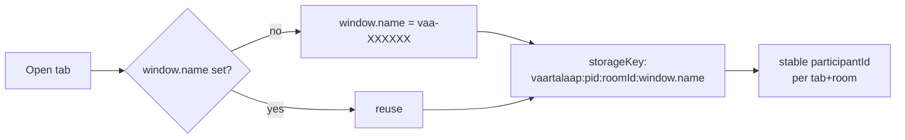

# apps/client

React 18 + Vite 5 SPA.

---

## Component graph



---

## Data flow per surface



---

## Theming

```mermaid
flowchart LR
  Init{Init} --> LS[localStorage<br/>vaartalaap:color-mode]
  Init --> OS[matchMedia<br/>prefers-color-scheme]
  LS --> Mode((mode))
  OS --> Mode
  Mode --> Theme[buildMuiTheme(mode)]
  Mode --> Doc[document.documentElement<br/>.dataset.colorMode]
  Theme --> MUI[MUI components]
  Doc --> Native[native chrome]

  Hook[useColorMode] --> CW[CodeWorkbench]
  CW --> CM[CodeMirror<br/>oneDark | defaultHighlightStyle]
  Hook --> WB[Whiteboard<br/>canvasBg + auto-contrast]
```

`useColorMode().toggle()` flips and persists.

---

## Key local state

| File | State | Purpose |
|---|---|---|
| `routes/Room.tsx` | `hasJoined`, `localParticipantId`, `userColor` | gates room UI; HSL-hash colour for cursors |
| `lib/yjs.ts` | `Map<roomId+docName, Lease>` | refcounted Y.Doc + Awareness + socket pipe |
| `lib/socket.ts` | singleton `io()` | shared across components |
| `styles/ColorModeProvider.tsx` | `mode` | persisted theme |
| `components/Whiteboard.tsx` | `strokes`, `scale`, `offset`, `activeColor` | local-first draw |

---

## Per-window identity



So two tabs of the same room never collide on participant id, and a refresh keeps the same id.

---

## Build / scripts

| Command | What |
|---|---|
| `npm run dev` (root) | Vite dev :5173 + server :4000 |
| `npm run build` | `vite build` |
| `npm run typecheck` | `tsc --noEmit` |
| `npm run lint` | ESLint |

---

## Env

```
VITE_API_BASE=http://localhost:4000
```

Resolved by `lib/api.ts` and `lib/socket.ts` for REST + WS endpoints. 
