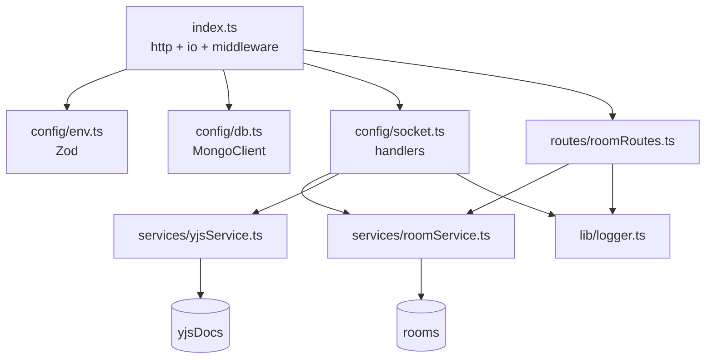
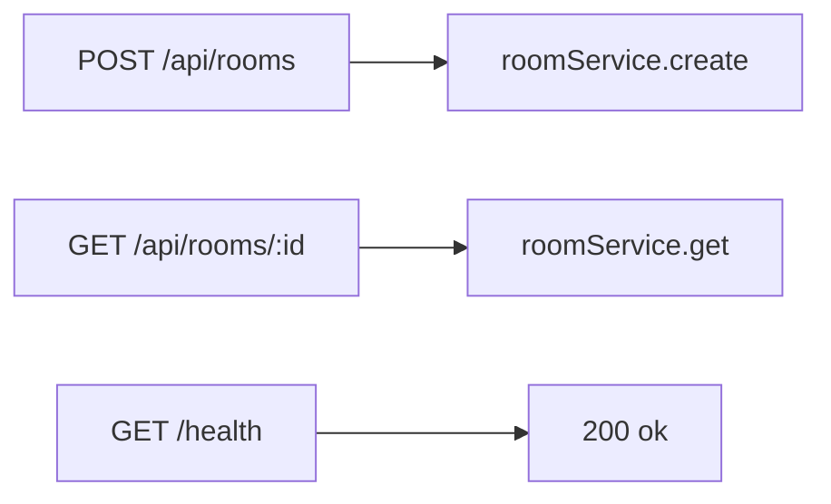
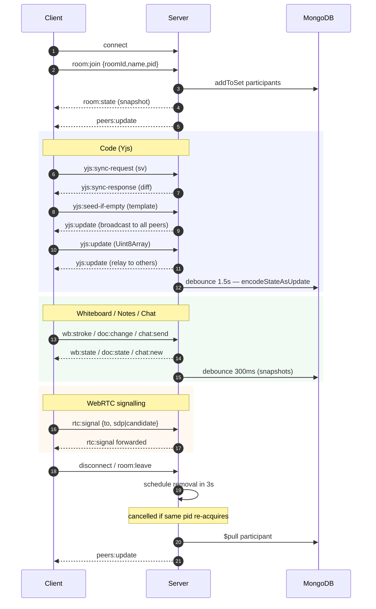
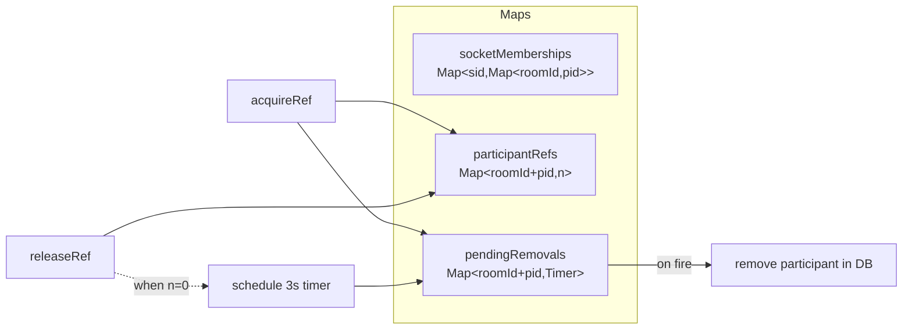
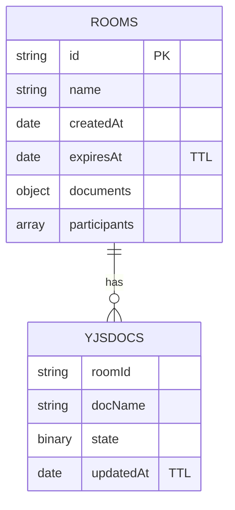
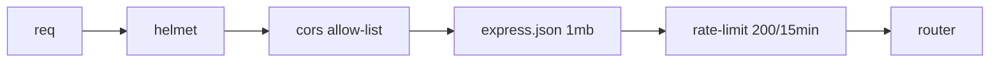

# apps/server

Express 4 + Socket.IO 4 + MongoDB. TypeScript, Node 18+.

---

## Module map



---

## REST endpoints



| Method | Path | Body | Returns |
|---|---|---|---|
| `POST` | `/api/rooms` | `{name?}` | `{id}` |
| `GET`  | `/api/rooms/:id` | — | `RoomSnapshot` |
| `GET`  | `/health` | — | `{status:"ok"}` |

---

## Socket.IO events



---

## Session model



Why: a fast refresh disconnects the old socket then reconnects within ~200 ms. Without the grace timer the participant would flicker out and in (and other rooms could lose state if pid maps weren't per-socket).

---

## Yjs service

```mermaid
flowchart LR
  In[yjs:update] --> Cache[Y.Doc cache<br/>Map roomId+docName → Y.Doc]
  Cache -- lazy load --> DB[(yjsDocs)]
  In --> Apply[Y.applyUpdate]
  Apply --> Bcast[broadcast to room (excl sender)]
  Apply -. debounce 1.5s .-> Persist[encodeStateAsUpdate → Mongo]
  Sync[yjs:sync-request sv] --> Diff[encodeStateAsUpdate(doc, sv)]
  Diff --> Out[yjs:sync-response]
  Seed[yjs:seed-if-empty] --> Check{ytext.length == 0?}
  Check -- yes --> Insert[Y.transact insert template] --> BcastAll[io.to(room) yjs:update]
  Check -- no --> Nack[ack seeded:false]
```

Caps:
- `MAX_DOC_BYTES = 1 MB` per `(roomId,docName)` — drops further updates when exceeded.
- Awareness packets are **never** persisted.
- `yjs:seed-if-empty` is the **single source of truth for first-write template seeding**. The server's atomic empty-check + insert prevents duplicate seeds when two clients open the same fresh room simultaneously; only the first request wins, the rest get `{seeded:false}` and pick up the canonical seed via the broadcast `yjs:update`.

---

## Storage



Indexes:
- `rooms`: `{id}` unique, `{expiresAt}` TTL `0`.
- `yjsDocs`: `{roomId,docName}` unique, `{updatedAt}` TTL `2592000`.

---

## Middleware



---

## Env (Zod-validated)

```
PORT=4000
NODE_ENV=development|production
MONGODB_URI=mongodb+srv://…
CLIENT_ORIGIN=http://localhost:5173
```

Bad / missing env → process exits with descriptive error.

---

## Scripts

| Command | What |
|---|---|
| `npm run dev` (root) | tsx watch :4000 |
| `npm run build` | `tsc -p tsconfig.json` → `dist/` |
| `npm start` | `node dist/index.js` |
